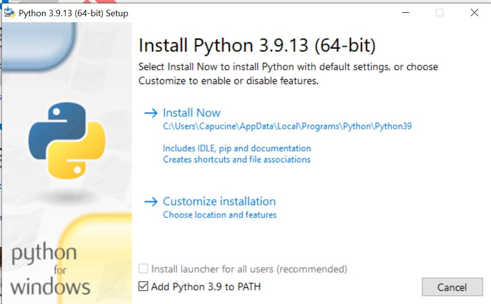

# Calcul de répartition des lits en néonatalogie

## Description de la bibliothèque

La bibliothèque **neonat** propose un algorithme calculant la meilleure allocation des lits aux bébés
du service en néonatalogie, dans un contexte de déménagement.
On constate un tel besoin dans les cas suivants :
- Quand les effectifs de bébés hospitalisés en néonatalogie sont conséquents ;
- Quand il existe des contraintes de traitements spécifiques aux bébés,
applicables à seulement certaines chambres ;
- Quand il y a un besoin de faire plusieurs changements de chambres.

L'objectif du package est de fournir un nouveau plan d'allocation de lits adapté
aux soins de chaque bébé, tout en minimisant le nombre de bébés déplacés.
Il s'appuie sur un simple fichier [Excel](#présentation-de-linput), et se lance comme [ceci](#lancer-le-calcul).

## Installation

Pour installer la bibliothèque, Vous aurez besoin d'installer :
- [python](https://www.python.org/downloads/windows/) version **3.9.13**;
  - ATTENTION : Cliquer sur **Add Python to PATH** pour insérer les liens pertinents dans le PATH :
   ;
  Puis ajouter les fichiers sources de Python à la racine, en inscrivant **C:\Python39**
  à l'option **Customize install location** ;
- [git](https://git-scm.com/download/) et choisir le système d'exploitation
parmi Windows, Linux, macOS ;

Ensuite vous pouvez récupérer le projet depuis Github. Pour cela :
- Cloner le répertoire du projet. Pour cela :
    - Ouvrir une Commande Prompt Windows ;
    - Créer un répertoire "src" et s'y placer en lançant les commandes suivantes :
        ```
        mkdir src
        cd src
        ```
    - Cloner le répertoire : git clone https://github.com/antoinedemuizon/neonat.git
- Initialiser le projet en double-cliquant sur *initialize_poject.bat*.

## Lancer le calcul

Pour lancer le calcul, il faut :
- Dans le répertoire "scenarios", créer un dossier **nom_de_votre_scenario** ;
- Y insérer un excel dûment rempli, nommé **input_nom_de_votre_scenario.xlsx** ;
- Double-cliquer sur *launch_main.bat*, puis remplir les champs suivants,
qui s'affichent alors dans l'invite de commande :
    - A la question **What is the scenario ...**, donner le nom du "scenario"
      que vous voulez lancer. Il peut s'agir d'un ancien scenario que vous souhaiter relancer.
    - A la question **If you want to force the process**, taper "--force"
      si vous souhaitez forcer le run malgré les avertissements (voir [Différents avertissements](#différents-avertissements)).

## Présentation de l'input

Vous pouvez dupliquer le fichier d'input du dossier "scenarios/exemple" comme base à compléter.

Le fichier Excel d'entrée de l'algorithme est composé de 3 onglets :
*babies*, *rooms*, *services*.

Vous êtes ensuite invités à remplir :
- Dans l'onglet *babies* :
    - La liste des bébés (colonne **babies**) ;
    - Le service auquel le bébé correspondant est affecté (colonne **babies_potential**) ;
    - L'ancien lit dans lequel ils étaient (colonne **old_alloc_list**) ;
    - Son traitement spécifique si le bébé nécessite une chambre spécifique (colonne **treatment**) :
      Ce traitement doit obligatoirement être présent dans la liste de traitements de l'onglet *rooms*.

- Dans l'onglet *rooms* :
    - Ne pas toucher la ligne "out" ;
    - La liste de TOUS LES LITS (colonne **all_rooms**).
      *rooms* désigne un lit. Ainsi, une chambre double aura 2 *rooms*.
    - La liste des NOUVEAUX LITS (colonne **new_rooms**).
      Inscrire *yes* dans les lignes correspondantes.
    - La liste des ANCIENS LITS (colonne **old_rooms**).
      Inscrire *yes* dans les lignes correspondantes.
    - Ne pas toucher la colonne **going_out** ;
    - Le service que la chambre peut proposer (colonne **new_rooms_service**).
      Plusieurs réponses possibles, à écrire dans une même cellule Excel en séparant avec une ",".
      Une seule sera choisie par le modèle, en accord avec le besoin du bébé.
    - L'ancien service que la chambre proposait (colonne **old_rooms_service**).
      Pas nécessaire au calcul, seulement informatif.
    - Le nombre de lit par chambre (colonne **rooms_capacities**).
      Laisser à 1 car chaque identifiant de "chambre" doit être celui d'un lit (cf remarque **all_rooms**).
    - La priorité de la chambre (colonne **priority**) :
      si la chambre comporte plusieurs services possible, on peut imposer une priorité
      en inscrivant "TRUE" dans la cellule correspondante.
      Le modèle cherchera alors à mettre dans cette chambre un bébé dont le service potentiel
      est "le plus haut" (cad avec un rang le plus faible).
    - Le traitement spécifique possible dans la chambre (colonne **treatment**) :
      Quelque soit le traitement inscrit ou si la cellule est vide,
      n'importe quel bébé "sans traitement" peut intégrer cette chambre.

- Dans l'onglet *services* :
    - La liste des services de néonatalogie disponibles.

> [!IMPORTANT]
> Ne mettre aucun accent dans les différents éléments de l'Excel.
> Veiller à la cohérence des données entre elles. Par exemple, si dans l'onglet *services*,
vous avez écrit les services suivants : ['reanimation', 'soins', 'neonat'], vous ne pouvez
pas affecter un enfant ou une chambre à un service 'rea', car il n'apparait pas tel quel
dans la liste de l'onglet *services*.

## Différents avertissements

La bibliothèque **neonat** intègre plusieurs boucles de contrôle avant de lancer
réellement le calcul. Ces boucles de contrôle indiquent les incohérences détectées dans le jeu de données
dans un fichier de log créé dans le dossier du scenario.

Si de telles incohérences surviennent, la fenêtre de lancement vous indiquera par exemple :
> utils.IncoherentDataError: There is a risk of unfeasability in your dataset, please reconsider it.

Si vous avez vérifié vos données, et qu'elles vous paraissent bonnes malgré le message d'incohérence,
vous pouvez lancer le calcul en double-cliquant sur *launch_main.bat*,
puis en ajoutant le paramètre "--force" à la question **If you want to force the process**.

## Prochaines étapes

Selon les besoins qui apparaitront, on peut ajouter une fonctionnalité qui vérifie
la faisabilité d'une solution donnée par l'utilisateur.

<!--


## Several bat files to help you run the project

*initialize_poject.bat* will :
- Install all the required packages ;
- Install the virtualenvwrapper ;


In the repository 'neonat' :
> pip install build
> python -m build

## About the logs

I introduced a minimalist log file, which mainly gives info about risk of unfeasability.
The possible error of data are of two categories :
- Mismatch between worksheet in the Excel. For exemple, in the sheet **babies**,
one has a *babies_potential* to go to "reanimation", whereas "reanimation" isn't defined in **services**
-->